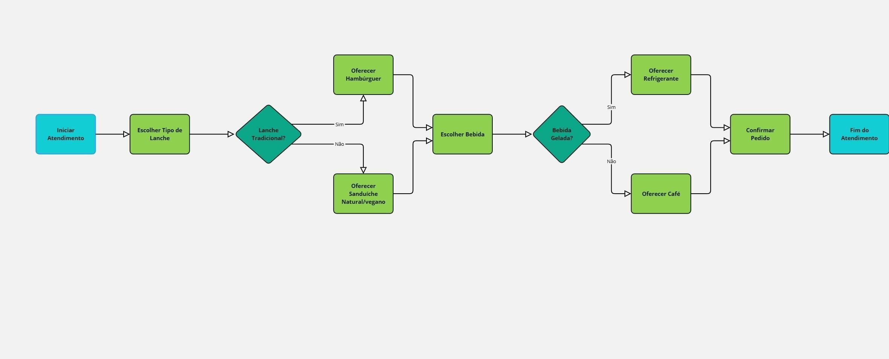
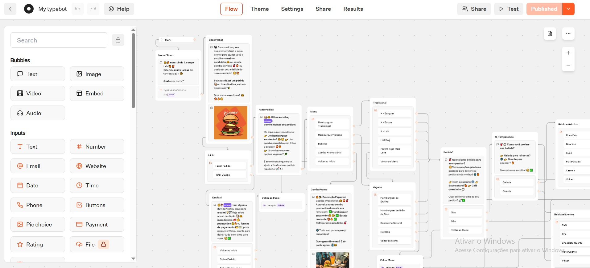

# CODING I |  Chatbot

✏ Para esta atividade, crie um chatbot usando o fluxograma apresentado em aula como referência.

Objetivos:

- Bubles para comunicação com o usuário
- Inputs para  dados de entrada (opção de resposta do usuário)
- Processamento e Fluxo de Decisão (sim ou não)
- Dados de saída (conclusão do processo e saída de dados)

💻 A [**atividade foi realizada no Typebot**](https://typebot.io/), uma plataforma que permite criar chatbots interativos sem necessidade de programação. Ele oferece uma interface visual intuitiva, onde você pode arrastar e soltar blocos para definir fluxos de conversa, coletar informações dos usuários e integrar com serviços externos.

👤 Atividade Individual

 ### Fluxo Sugerido

 
 ### Desenvolvimento | Typebot

⬇ Acesso ao Chatbot no link abaixo.

[___Acesso ao Chatbot___](https://typebot.co/my-typebot-tmytafa)
