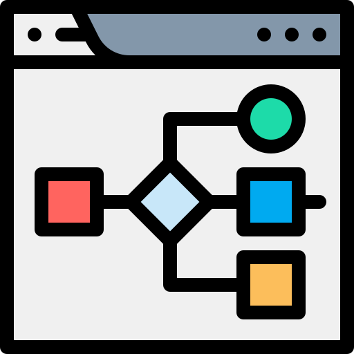
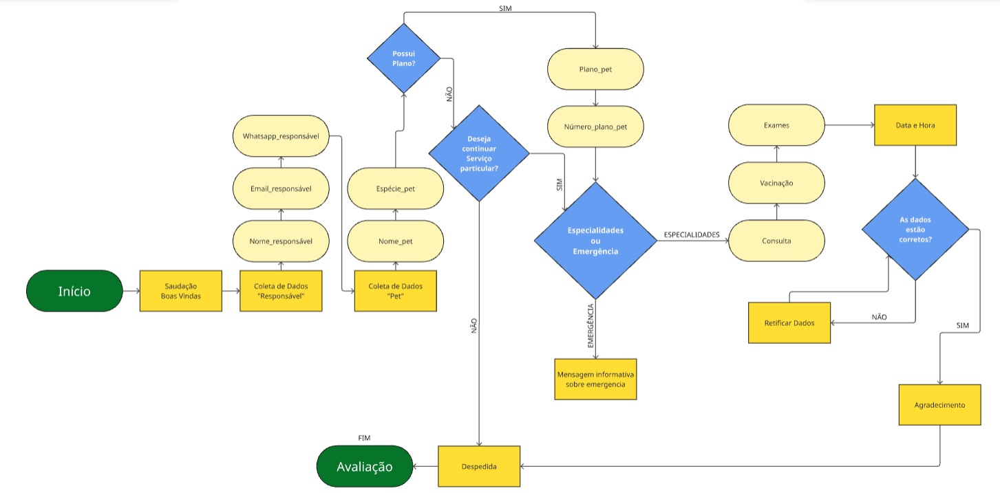
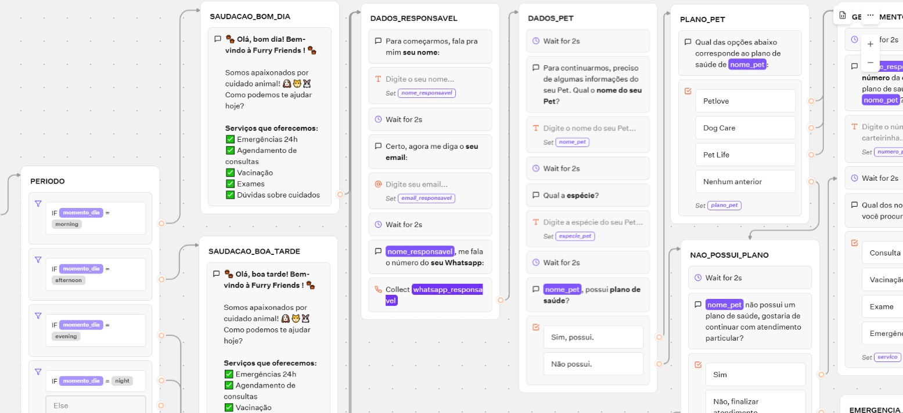
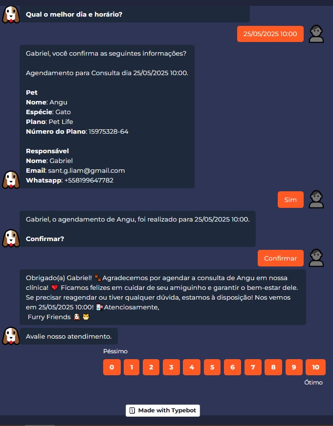

# CODING I | Sobre Low Code  

✏ Para esta atividade, serão explorados os conceitos básicos de algoritmos

💻 A atividade foi realizada na Miro, uma plataforma colaborativa que facilita o desenvolvimento de ideias e projetos, permitindo que diferentes usuários trabalhem simultaneamente em um mesmo projeto.

👤 Atividade Individual.

Low code é uma abordagem de desenvolvimento de software que requer pouca ou nenhuma codificação tradicional.
Utiliza plataformas visuais com componentes pré-prontos para criar aplicações rapidamente.
É ideal para agilizar projetos e permitir que usuários não técnicos colaborem no desenvolvimento.

### Por que usar Low Code?

| Acessibilidade       | Colaboração       | Custo Benefício |
|------------------|------------------------|------------------|  
       
### Exemplos de uso Low Code

| Automatização    | Chatbots - Virtual Assistant  | ERP’s |
|------------------|------------------------|------------------| 
|        |        |  |

# O que vamos aprender

- Conceito de Algoritimo
- Tecnologias Low Code
- Typebot
  

# </a> Algoritmos 

São sequências de passos lógicos e finitos para resolver um problema ou realizar uma tarefa.
Eles podem ser usados em programação, matemática, e no dia a dia (como seguir uma receita).
São a base do funcionamento de softwares, sistemas e inteligência artificial.

- Como Funciona:
  
| Input       | Logic and processing       | Output |
|------------------|------------------------|------------------|
| Dados de Entrada | Lógica e Processamento | Dados de   saída |

- Estruturas Condicionais:

| SE       | SENÃO SE       | SENÃO |
|------------------|------------------------|------------------|
| IF | ELIF | ELSE |

# [✏Atividade](https://miro.com/app/board/uXjVIGyo8JM=/)

### Instruções 

Use fluxogramas ou diagramas para mapear a jornada do usuário.
Comece com uma mensagem de boas-vindas e descreva a sequência de perguntas que o chatbot fará.
Certifique-se de incluir pontos de decisão onde o usuário possa escolher opções.

Rotule claramente cada parte do processo, como:
Mensagem de boas-vindas
Perguntas (por exemplo, nome, número do cartão, especialidade, dia, hora)
Mensagem de confirmação
Use cores ou ícones para diferenciar entre as entradas do usuário e as respostas do sistema.

**Desenvolva o algoritmo no Typebot**

Faça login no Typebot e crie um novo projeto para o seu chatbot.
Familiarize-se com a interface e as ferramentas disponíveis.
Crie a mensagem de boas-vindas:

Comece programando o chatbot para cumprimentar os usuários.
Exemplo: "Bem-vindo à [Nome da Clínica]! Como posso ajudá-lo hoje?"
Perguntas de entrada:

Determine como você salvará as variáveis para cada entrada do usuário.
Crie variáveis para:
Nome de usuário
Número do cartão
Especialidade de Atendimento
Dia e hora da consulta
Use tipos de dados apropriados para cada variável (por exemplo, string para nome, número inteiro para número do cartão).
Analise a mensagem de saída:
Prepare a mensagem de saída personalizada que confirmará o agendamento.

### Submissão

Depois de concluir o [chatbot](https://typebot.co/furry-friends-4hks7mg) e testá-lo completamente, envie o link do seu quadro [Miro](https://miro.com/app/board/uXjVIGyo8JM=/) e uma breve descrição da funcionalidade do seu chatbot.
Certifique-se de que seu projeto Typebot esteja acessível para revisão.

